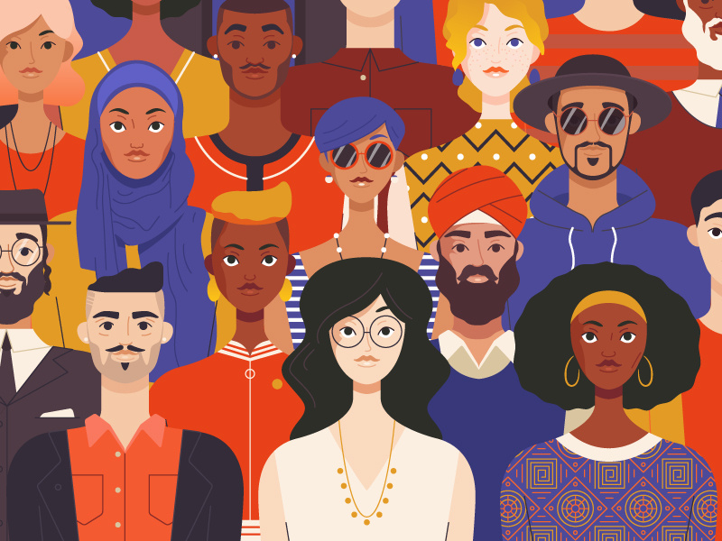

# Closed Doors: How are Art Museums using Social Media to Engage an Online Audience?
## Chloe Akazawa DH 100, 101 Summer 2020

This Project studies the tweet content, likes, and retweets of 15 US art museums. Art museums have often distanced themselves from controversial
current events and social media trends, focusing their platforms to promote upcoming & ongoing exhibits. However, during this period of social distancing and quarantine, museums must now diversify their online presence, become more socially conscious, and actively involve a greater audience. I'm studying current social media strategies of art museums and intend to provide insights on how museums can effectively use their platforms. 

### Questions: 
* What are the common topics that  museums are currently highlighting on their social media?
* What are the themes of museum tweets which gain the most interaction & attention? 
* Are museums interacting with current events? (Black Lives Matter? LGBTQ Pride Month?) 

### Methods featured:
* Tweepy: Access & gather tweet content, date, number of likes, retweets 
* Pandas: Manipulate Twitter data into dataframe
* Natural Language Tool Kit: Clean texts (remove stopwords, punctuation)
* WordCloud: Create word clouds of most used words from Tweets
* Matplotlib: Visualize word frequency & retweets, likes through bar graphs

During quarantine, museums are applying art to current social activism, integrating art into community, and transmitting art out of the gallery into everyday life. The most popular tweets include responses to current events, solidarity with communities, and conversations with other museums. Surprisingly, smaller museums experience the most user engagement. These museums are interacting directly with their surrounding communities, & their popular tweets actively participate in current events (local protests, organizations, etc.) in contrast to large institutions who post more generalized content. The results of this study offer helpful ways museums can diversify their content and broaden their online outreach & accessibility in the future. 
(Image credit: Emmanuelle Walker)

# DH 101 Group Project Presentation:Inclusivity in the Digital Humanities
## Chloe Akazawa and Anusha Subramanian Summer 2020

This presentation addresses the importance of inclusion of minority voices and of the arts discipline in computational research. Drawing from "Arts and Creation of Mind" by Elliot Eisner, "Making a Case for the Black Humanities" by Kim Gallon, and "Critical Questions for Big Data" Danah Boyd and Kate Crawford, we argue that the inclusion of new ideas and individuals in the Digital Humanities will broaden the possibilities of the field. Learning about the nuances and issues of computational research was really eye-opening. While I come from a background of Humanities, my teammate Anusha comes from a STEM background, so it was interesting to discuss our different experiences with technology and to brainstorm different ways to promote inclusivity. Both of us enjoy STEM and Humanities, and the Digital Humanities opens new opportunities to unite our interests, revealing that the arts and the sciences are equally important and complimentary. Overall, Anusha and I agree that although there's this myth that 'numbers speak for themselves' a humanistic perspective is vital to computational research, and authors need to be held accountable for their results. By including more voices and arts disciplines in computational research, we will gain a more comphrehensive understanding of humanity. 
(Image credit: Nick Slater)
